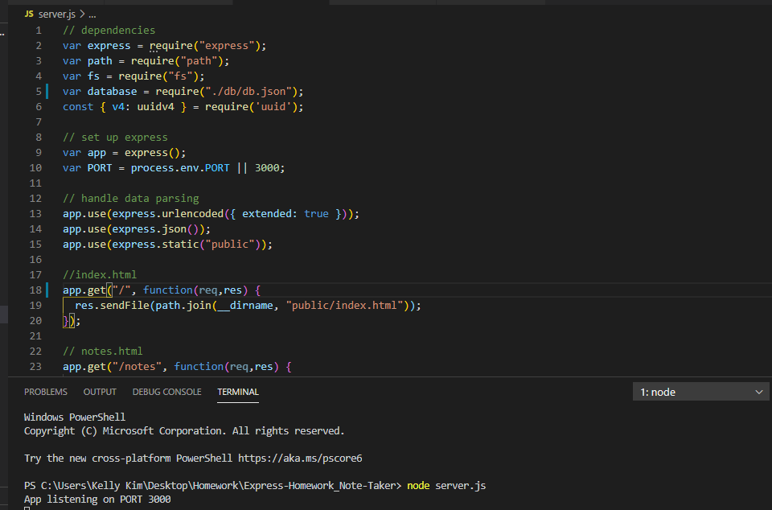

# Express-Homework_Note-Taker

 ## Description 
 The Express-Homework Note Taker assignment was to create an application that can be used to write, save, and delete notes. This application will use an express backend and save and retrieve note data from a JSON file.
 
## Process
  The first step was to install node and the dependencies were express and uuid. I worked on creating the HTML routes and the db.json file. We also had to create GET, POST and DELETE API's. This was a very useful project as the application allows users to create and save notes, and to view previously saved notes and delete them afterwards. Please see below for some snippets:

 My Note Taker that got generated from Git Bash:

 
 Snippet of me adding my first note:
 
 After saving the first note:
 
 Viewing my other saved notes:
 
  Snippet of my code and my node server.js in action:
 

 ## Installation
 You will need VS code and the dependencies are express and uuid.
 
 ## Usage 
 For users that need to keep track of a lot of information, it's easy to forget or be unable to recall something important. Being able to take persistent notes allows users to have written information available when needed.
 

### Installing/Technology Used

The following platforms were required to build this website:

1) VS code
2) GitBash/Terminal
3) GitLab
4) GitHub
5) Express
6) UUID

## Built With

* [Node.js](https://nodejs.dev/learn/the-package-json-guide)
* [UUID](https://www.uuidgenerator.net/)
* [Express](http://expressjs.com/)

## Deployed Link

* [See Live Site](https://powerful-river-23113.herokuapp.com/)
 ## Authors

* **Kelly Kim** 

- [Link to Github](https://github.com/kellykim831)
- [Link to LinkedIn](https://www.linkedin.com/in/realtorkellykim/)
- [Link to Facebook](https://www.facebook.com/kimkelz)

## Acknowledgments

* [Link to Google](https://www.google.com)
* [Link to W3 Schools](https://www.w3schools.com)
* [Link to StackOverflow](https://www.stackoverflow.com)
* [Link to Node.js](https://nodejs.org/en/)